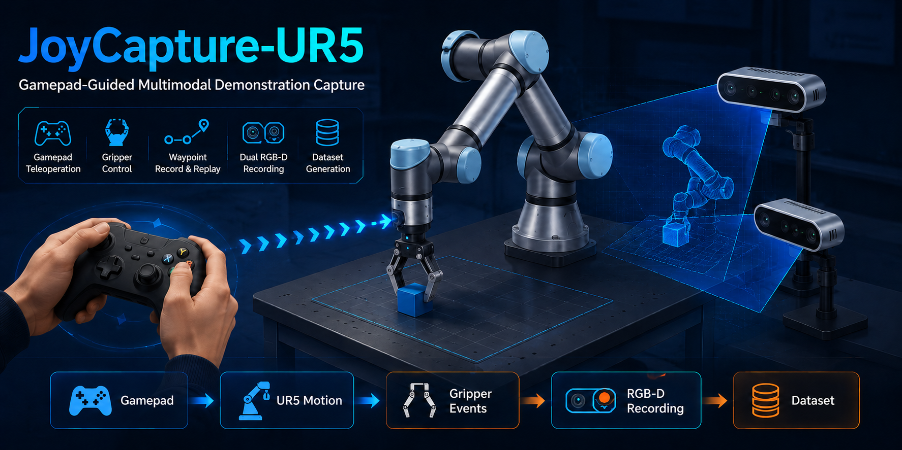
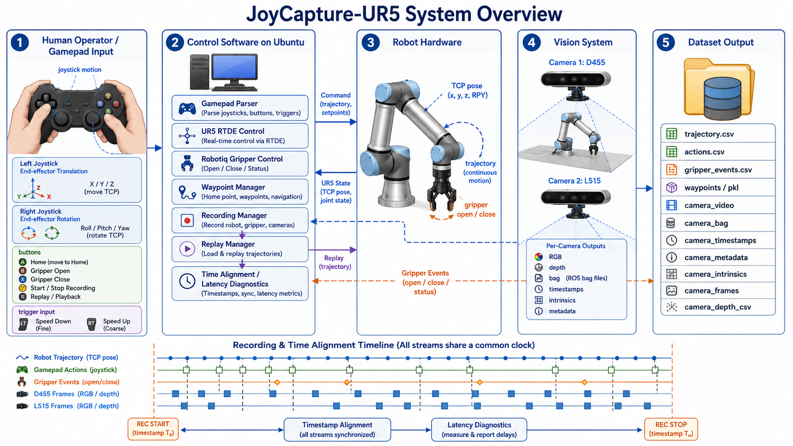

# JoyCapture-UR5

[English](README.md) | [中文](README.zh-CN.md)

**JoyCapture-UR5：面向 UR5 操作任务的手柄遥操作与多模态示教采集系统**

JoyCapture-UR5 是一个轻量级的 Xbox/手柄遥操作与多模态数据采集系统，用于 UR5 机械臂操作任务。系统可以记录机器人轨迹、夹爪事件、手柄动作，以及同步的 RGB-D 相机数据流。



实时录制采用“源数据优先”的工作流：遥操作过程中只写入机器人/动作/夹爪 CSV、会话元数据、相机同步表，以及每个 RealSense 相机的 `.bag` 文件。视频、图像/深度帧、HDF5 episode 和 RLDS 风格数据集会在录制结束后通过离线后处理生成。

完整配置、输出结构、数据集格式和排错说明见 [docs/DETAILS.md](docs/DETAILS.md)。

## 功能

- 使用 Xbox 手柄遥操作 UR5 TCP 运动。
- 支持 Robotiq 夹爪激活，以及打开/闭合切换。
- 支持设置 home pose 和返回 home pose。
- 支持原始轨迹录制与回放。
- 支持 Intel RealSense D455 和 L515 双相机录制。
- 支持配置并检查机器人与相机采样 FPS 是否一致。
- 实时录制阶段优先写入轻量级 raw 源数据。
- 支持离线导出检查视频、图像帧、深度 CSV、HDF5 和 RLDS 风格数据。

## 硬件

- UR5 / UR 控制柜，示教器上可用 External Control。
- Robotiq 夹爪，通常通过 socket 控制，常用端口为 `63352`。
- 可被 Linux input 设备读取的 Xbox 兼容手柄。
- Intel RealSense D455。
- Intel RealSense L515。
- 与机器人控制柜处于同一网络的 Ubuntu 主机。

## 快速开始

在 Ubuntu 上从全新 clone 开始：

```bash
cd JoyCapture-UR5
sudo apt update
grep -vE '^\s*(#|$)' env/ubuntu_system_packages.txt | sudo xargs apt install -y
conda env create -f env/environment.yml
conda activate UR_xbox
./scripts/setup_urxbox_env.sh all
./scripts/check_urxbox_env.sh all
cp config/teleop_launcher_config.json config/teleop_launcher_config.local.json
```

编辑 `config/teleop_launcher_config.local.json`，填入本机机器人和相机配置。至少需要设置 `robot_host`，确认相机条目，并根据工具/相机安装方向调整 `motion.xy_rotate_deg` 和 `motion.rot_axes_rotate_deg`。

运行前请确认：

- Xbox 手柄、D455、L515 和机器人网线已连接。
- 机器人控制柜和 Ubuntu 主机处于同一网络。
- UR 示教器上的 External Control 程序已准备好运行。

启动遥操作：

```bash
./run_ur5_xbox_ubuntu.sh
```

如果 `conda` 不在 `PATH` 中，可以显式传入：

```bash
./run_ur5_xbox_ubuntu.sh --conda-bin /path/to/conda --env-name UR_xbox
```

如果通过 zip 下载仓库后 shell 脚本不可执行：

```bash
chmod +x run_ur5_xbox_ubuntu.sh scripts/*.sh
```

## 手柄映射

- 左摇杆：TCP 左 / 右 / 上 / 下。
- `LB` / `RB`：TCP 后退 / 前进。
- `LT` / `RT`：工具俯仰。
- 右摇杆左 / 右：工具自旋转。
- 右摇杆上 / 下：腕部 / 末端旋转。
- `X`：夹爪打开 / 闭合。
- `Y`：开始 / 停止录制。
- `A`：设置 home pose。
- `B`：移动到 home pose。
- `Back`：回放最新内存轨迹，或从配置的回放目录加载 raw 轨迹。
- `Start`：退出。

在 Xbox 手柄上，`Back` 通常标为 `View`，是中间偏左、带两个重叠方块的小按钮；`Start` 通常标为 `Menu`，是中间偏右、带三条横线的小按钮。

## 运行

默认运行：

```bash
./run_ur5_xbox_ubuntu.sh
```

运行并录制到某个任务 raw 文件夹：

```bash
./run_ur5_xbox_ubuntu.sh \
  --env-name UR_xbox \
  --output-dir /home/user/Desktop/JoyCapture-UR5/paths/task_name
```

遥操作时按 `Y` 开始/停止一次录制。若 `recording.session_subdirs=true`，同一任务下的多次录制会保存为：

```text
paths/task_name/1/
paths/task_name/2/
paths/task_name/3/
```

程序重启后，从某个任务文件夹回放最新 raw 轨迹：

```bash
./run_ur5_xbox_ubuntu.sh \
  --env-name UR_xbox \
  --output-dir /home/user/Desktop/JoyCapture-UR5/paths/new_task \
  --playback-dir /home/user/Desktop/JoyCapture-UR5/paths/task_name \
  --playback-session latest
```

随后按手柄上的 `Back` / `View`。如果要回放某个具体会话，把 `latest` 替换成会话 id，例如 `20260523_230941`。

`--playback-dir` 可以指向 `paths/`、`paths/task_name` 这样的任务文件夹、`paths/task_name/1` 这样的编号录制文件夹，或一个具体的 `session_manifest_*.json` 文件。程序会递归搜索已保存的 raw 会话。

## 检查录制结果

列出已保存会话：

```bash
find paths -path '*/session_metadata/session_manifest_*.json' | sort
```

查看最新 manifest：

```bash
python -m json.tool "$(find paths -path '*/session_metadata/session_manifest_*.json' | sort | tail -n 1)"
```

一次正常录制通常应包含：

- `point_count` 大于 `0`。
- `action_row_count` 大于 `0`。
- 两个相机条目，通常为 `d455` 和 `l515`。
- 每个相机的 `frame_count` 为正数。
- 每个相机都有存在的 `.bag`、timestamp CSV、metadata JSON 和 intrinsics JSON 路径。
- 当 `recording.require_fps_match` 为 `true` 时，`recording.robot_fps` 与配置的相机 FPS 一致。

快速列出某个任务生成的文件：

```bash
find paths/task_name -maxdepth 4 -type f | sort
```

## 离线后处理

从最新 raw 录制生成常用输出：

```bash
./scripts/postprocess_recording.sh --input paths --session latest --outputs video,frames,depth_csv,hdf5,rlds
```

常用选择：

```bash
# 快速生成检查视频。
./scripts/postprocess_recording.sh --input paths --session latest --outputs video

# 导出图像/深度文件和 HDF5，用于训练。
./scripts/postprocess_recording.sh --input paths --session latest --outputs frames,depth_csv,hdf5

# 转换一个具体会话 id。
./scripts/postprocess_recording.sh --input paths --session 20260523_221812 --outputs video,frames,depth_csv,hdf5,rlds
```

## 项目结构

- `run_ur5_xbox_ubuntu.sh`：根启动脚本。
- `src/`：遥操作、相机服务、机器人初始化、数据转换和后处理代码。
- `scripts/`：环境安装、检查、数据转换、后处理和 L515 服务入口。
- `config/`：公开启动配置模板，以及被 git 忽略的本地配置覆盖文件。
- `requirements/`：按 robot、camera、dataset 和 all 模式拆分的 pip 依赖列表。
- `env/`：Conda 环境文件、Ubuntu 系统包列表和 `.env` 模板。
- `docs/`：详细文档。
- `paths/`：生成的录制和后处理数据集目录，已被 git 忽略。

## 项目预览



## 贡献

欢迎提交 issue 和 pull request。提交前请确认不要把本地机器人地址、私有实验室路径、生成的录制数据、相机 dump 和机器相关配置提交到仓库。

推荐工作流：

```bash
git checkout -b feature/short-description
# 修改代码
git status
git diff
```

然后推送分支并发起 pull request。

## 许可证

本项目使用 MIT License 发布，见 [LICENSE](LICENSE)。

## GitHub 注意事项

不要提交生成文件或机器本地内容：

- `.vendor/`
- `.tmp/`
- `.pip-cache/`
- `paths/`
- `config/teleop_launcher_config.local.json`
- 录制媒体/数据集文件，例如 `.bag`、`.mp4`、`.avi`、`.pkl`、`.hdf5`、`.h5`
